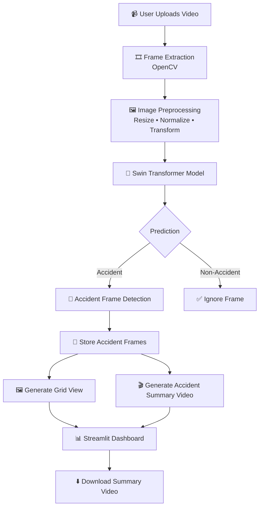

# AI-Powered Road Accident Detection and Video Summarization


An AI-powered computer vision system that detects road accidents from uploaded videos using a Swin Transformer model. The application identifies accident scenes, extracts important accident frames, generates a summarized accident video, and provides an interactive Streamlit interface.

---

## Features

- Upload traffic surveillance videos
- Detect Accident / Non-Accident scenes
- Deep learning model using Swin Transformer
- Confidence-based accident prediction
- Accident frame extraction
- Grid view of key accident frames
- Accident summary video generation
- Download processed videos
- Interactive Streamlit interface


### Accident Summary

(Add screenshot)

---

## 🏗️ Project Architecture



## Tech Stack

- Python
- PyTorch
- Swin Transformer
- OpenCV
- Streamlit
- NumPy
- Pillow
- TorchVision

---

## Project Structure

```text
app.py
README.md
requirements.txt
models/
sample_videos/
outputs/
images/
```

---

## Installation

Clone repository

```bash
git clone https://github.com/prajapativikram/Road-Accident-Detection-using-Swin-Transformer
.git
```

Move inside folder

```bash
cd Road-Accident-Detection-using-Swin-Transformer

```

Install dependencies

```bash
pip install -r requirements.txt
```

Run Streamlit

```bash
python -m streamlit run app.py
```

---

## Model

The project uses a fine-tuned Swin Transformer for binary classification.

Classes:

- Accident
- Non Accident

Framework:

PyTorch

---

## Dataset

The model was trained on a road accident dataset containing accident and non-accident images extracted from traffic videos.

If the dataset cannot be redistributed, include a link to the original source instead of uploading it.

---

## Results

| Metric | Score |
|---------|------:|
| Accuracy | 94% |
| Precision | 95% |
| Recall | 94% |
| F1 Score | 94% |

Classification Report

```
Accident

Precision : 1.00
Recall : 0.87
F1 Score : 0.93

Non Accident

Precision : 0.90
Recall : 1.00
F1 Score : 0.95

Overall Accuracy : 94%
```

---

## Future Improvements

- YOLO based vehicle localization
- Automatic accident timeline
- Whisper transcript generation
- Multi-camera support
- Cloud deployment
- Real-time CCTV monitoring

---

## Author

Vikram Kumar

B.Tech Computer Science & Engineering

AI • Machine Learning • Computer Vision

LinkedIn: https://www.linkedin.com/in/vikram-kumar-0b19a9248/


---

## License

MIT License
